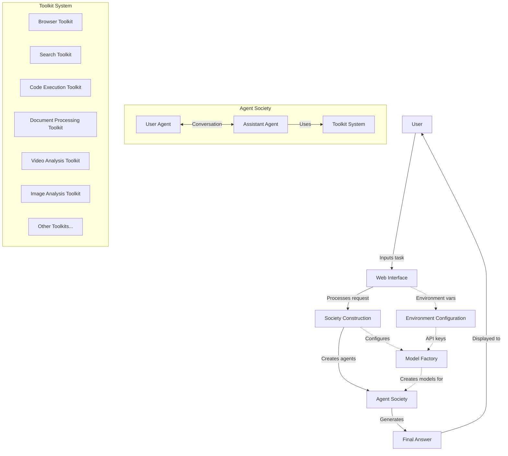
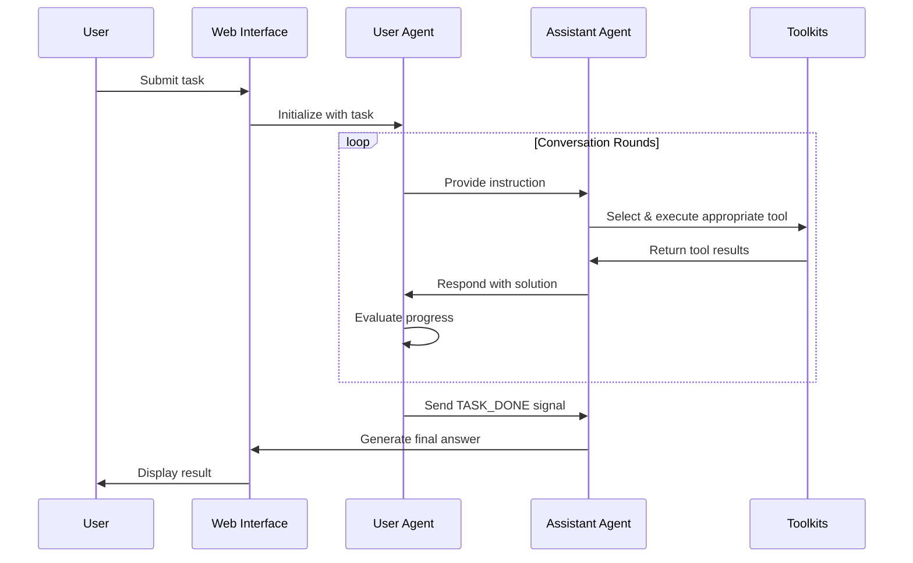
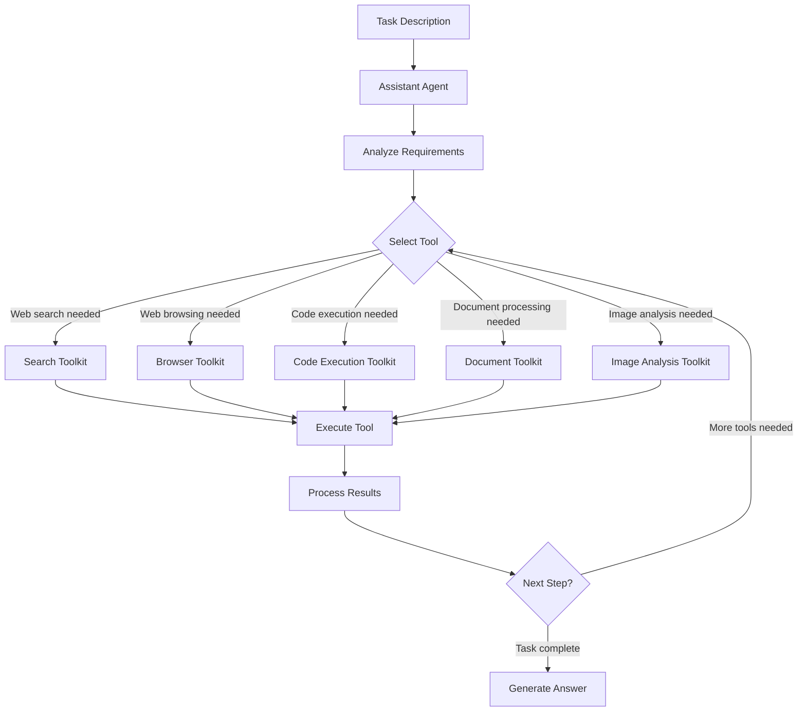
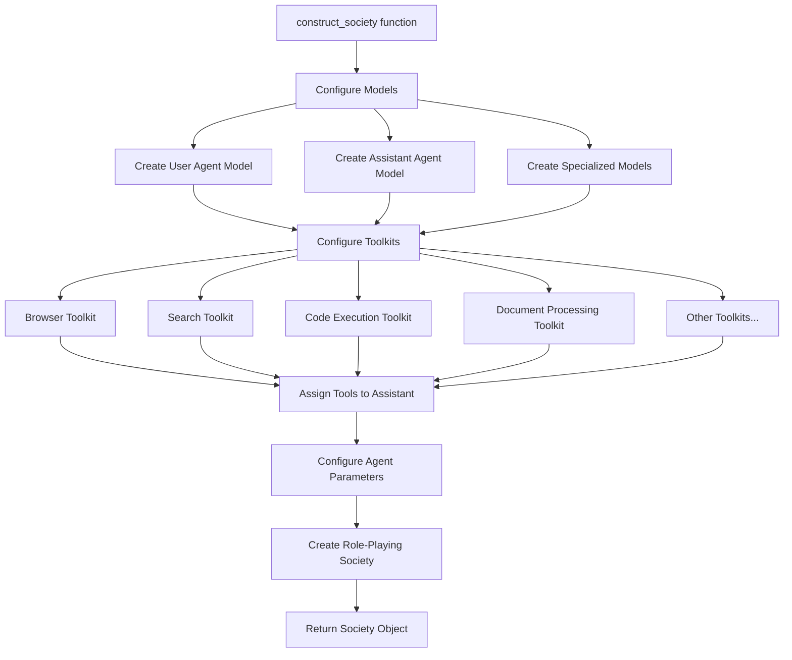
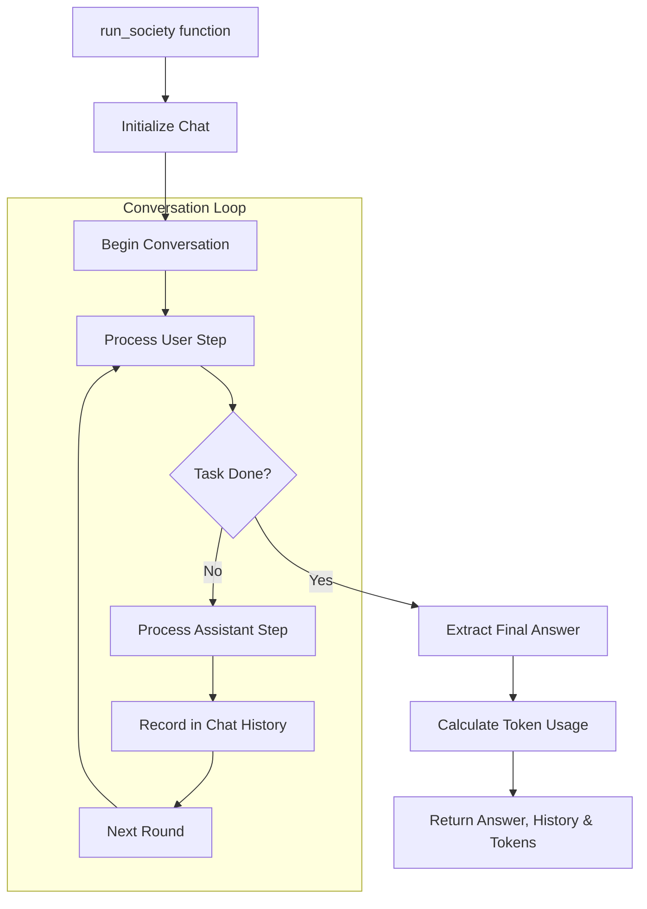
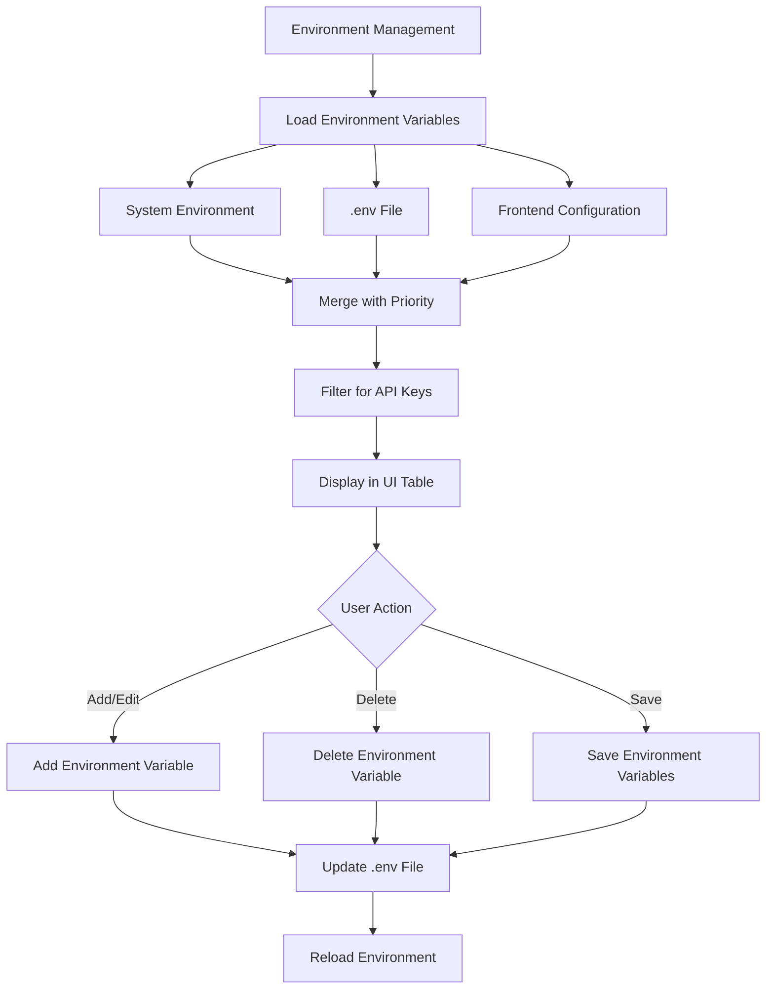
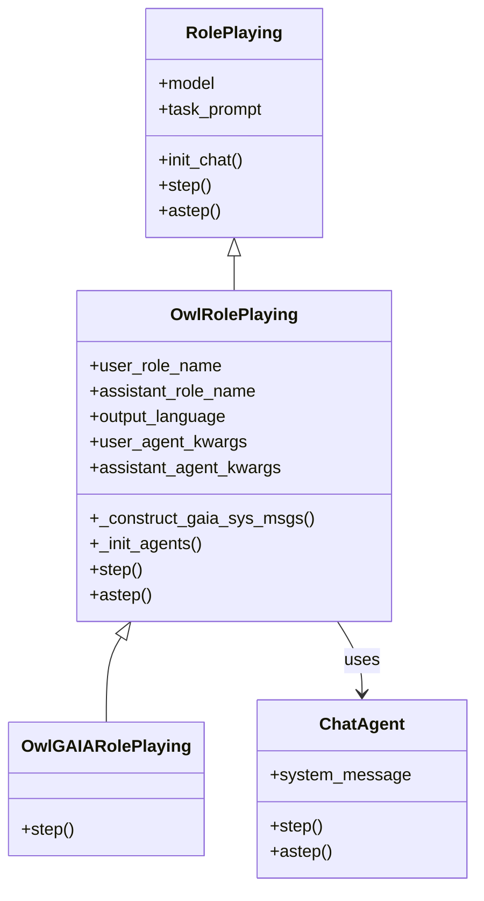

# OWL System Architecture Diagrams

## High-Level System Overview



## Conversation Flow Process



## Tool Selection Process



## Society Construction Process



## Run Society Process



## API Server Architecture

```mermaid
flowchart TD
    Entry[main.py FastAPI application] --> SetupLogging[Setup Logging]
    SetupLogging --> ConfigMiddleware[Configure Middleware]
    ConfigMiddleware --> RegisterRouters[Register API Routers]
    
    subgraph "API Routers"
        ModulesRouter[Modules Router]
        EnvRouter[Environment Router]
        ChatRouter[Chat Router]
        LogsRouter[Logs Router]
    end
    
    RegisterRouters --> ModulesRouter & EnvRouter & ChatRouter & LogsRouter
    
    subgraph "Service Layer"
        ModuleManager[Module Manager]
        EnvManager[Environment Manager]
        OwlRunner[OWL Runner]
        LogManager[Log Manager]
        TaskRegistry[Task Registry]
    end
    
    ModulesRouter --> ModuleManager
    EnvRouter --> EnvManager
    ChatRouter --> OwlRunner
    LogsRouter --> LogManager
    OwlRunner -.->|Stores tasks| TaskRegistry
    
    subgraph "Communication Channels"
        RESTEndpoints[REST Endpoints]
        WebSocketEndpoint[WebSocket Endpoint]
    end
    
    ChatRouter --> RESTEndpoints & WebSocketEndpoint
    
    OwlRunner --> OWLCore[OWL Core Functionality]
    OWLCore --> BuildSociety[Build Society]
    BuildSociety --> RunSociety[Run Society]
    
    RESTEndpoints & WebSocketEndpoint --> ClientApp[Client Application]
    
    subgraph "API Endpoints"
        ModulesAPI[/modules/ GET]
        ModuleDetailsAPI[/modules/{name} GET]
        EnvListAPI[/env/list GET]
        EnvCheckAPI[/env/check GET]
        EnvSetAPI[/env/set POST]
        RunAsyncAPI[/run/async POST]
        TaskStatusAPI[/run/task/{id} GET]
        TasksListAPI[/run/tasks GET]
        LogsAPI[/logs GET]
        LogsFilesAPI[/logs/files GET]
        WebSocketAPI[/run/ws WebSocket]
    end
    
    ModulesRouter --> ModulesAPI & ModuleDetailsAPI
    EnvRouter --> EnvListAPI & EnvCheckAPI & EnvSetAPI
    ChatRouter --> RunAsyncAPI & TaskStatusAPI & TasksListAPI & WebSocketAPI
    LogsRouter --> LogsAPI & LogsFilesAPI
```

## Web Frontend Architecture 

```mermaid
flowchart TD
    Entry[App.tsx main component] --> RouterSetup[Setup React Router]
    RouterSetup --> ModuleContext[Initialize Module Context]
    ModuleContext --> RenderLayout[Render App Layout]
    
    subgraph "Main Tab Components"
        Conversation[Conversation Tab]
        Logs[Logs Tab]
        Settings[Settings Tab]
        Tools[Tools Tab]
        Tasks[Tasks Tab]
    end
    
    RenderLayout --> Conversation & Logs & Settings & Tools & Tasks
    
    subgraph "Conversation Components"
        ConversationPanel[Conversation Panel]
        SplitLeftPanel[Split Left Panel]
        SplitLeftPanel --> ConversationHistory[Conversation History]
        SplitLeftPanel --> ModuleSelector[Module Selector]
    end
    
    Conversation --> ConversationPanel & SplitLeftPanel
    
    subgraph "API Service Layer"
        ApiService[API Service]
        WebSocket[WebSocket Connection]
        RESTCalls[REST API Calls]
        
        subgraph "API Methods"
            RunQuery[runQuery]
            WebSocketQuery[sendWebSocketQuery]
            GetModules[getAvailableModules]
            GetEnvVars[getEnvironmentVariables]
            UpdateEnvVars[updateEnvVars]
            ListTasks[listTasks]
            GetLogs[getLogs]
            CancelTask[cancelTask]
        end
    end
    
    ApiService --> WebSocket & RESTCalls
    ApiService --> RunQuery & WebSocketQuery & GetModules & GetEnvVars & UpdateEnvVars & ListTasks & GetLogs & CancelTask
    
    ConversationPanel -->|Uses| RunQuery & WebSocketQuery
    ModuleSelector -->|Uses| GetModules
    Settings -->|Uses| GetEnvVars & UpdateEnvVars
    Logs -->|Uses| GetLogs
    Tasks -->|Uses| ListTasks & CancelTask
    
    WebSocket & RESTCalls --> ServerAPI[Server API]
    
    subgraph "API Endpoints"
        ModulesAPI[/api/modules]
        EnvAPI[/api/env]
        RunAPI[/api/run]
        LogsAPI[/api/logs]
        WsAPI[/api/run/ws]
    end
    
    ServerAPI --> ModulesAPI & EnvAPI & RunAPI & LogsAPI & WsAPI
```

## Environment Variable Management Process



## OwlRolePlaying Class Structure

